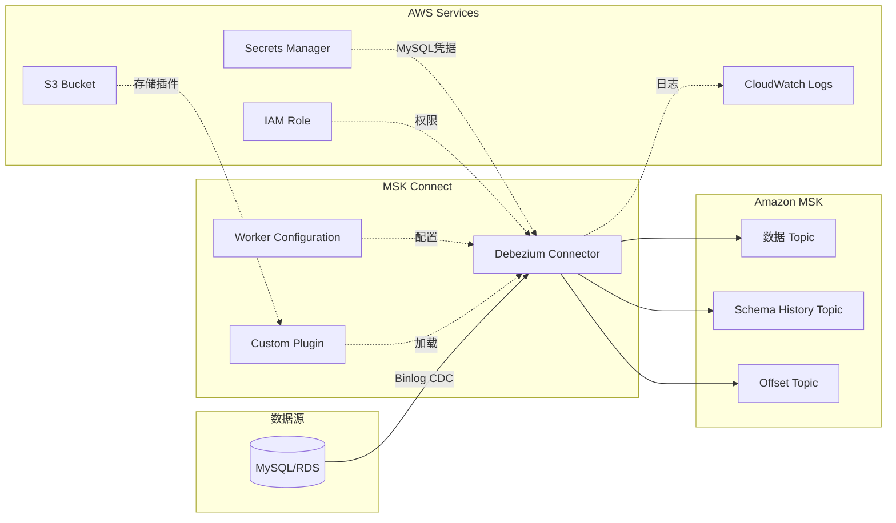
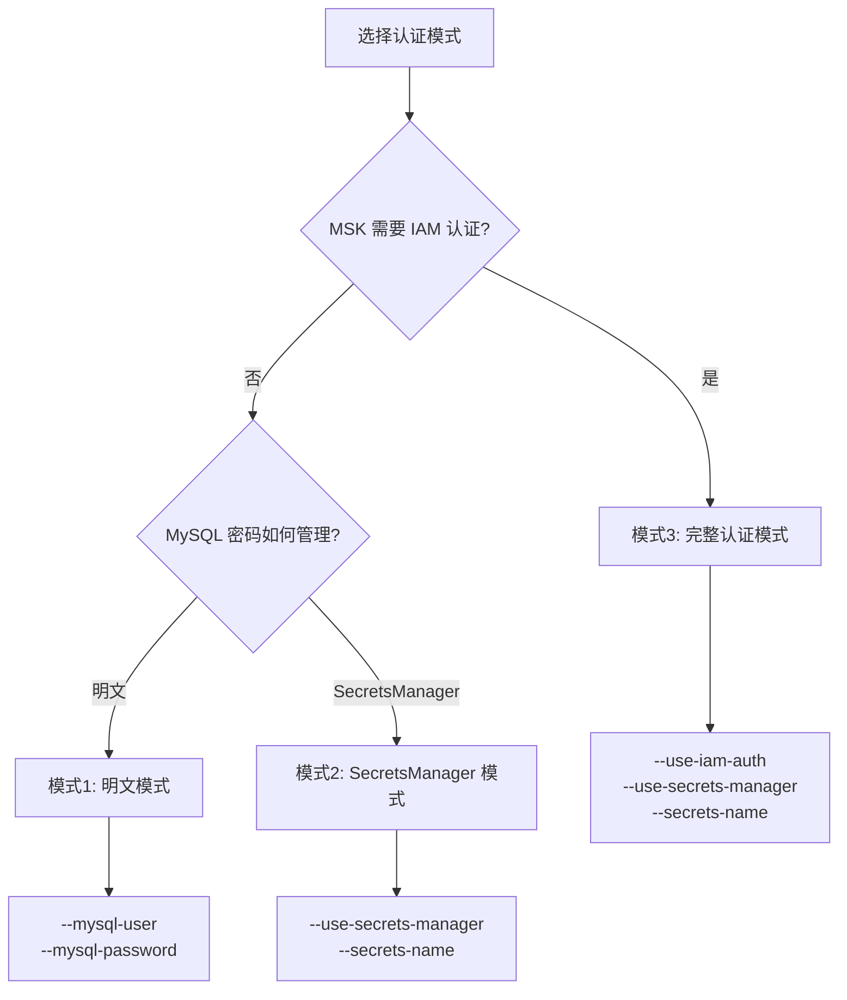
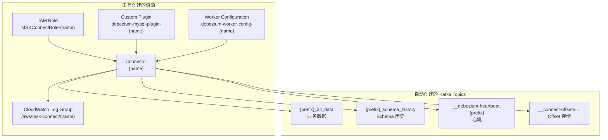
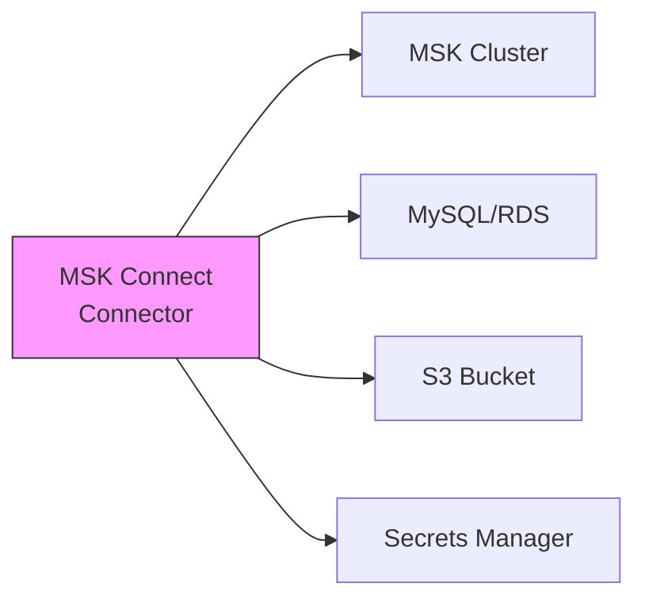

# MSK Debezium MySQL Connector 管理工具

用于创建和管理 AWS MSK Connect Debezium MySQL Connector 的命令行工具。

## 项目结构

```
msk-connector/
├── msk_debezium_connector.py   # 主工具 - 创建/删除 Connector
├── verify_connector.py         # 验证脚本 - 测试 CDC 数据流
├── pyproject.toml              # 项目配置
├── uv.lock                     # 依赖锁定
└── README.md
```

## 架构概览



## 支持的认证模式



| 模式 | MSK 认证 | MySQL 密码 | 适用场景 |
|------|----------|-----------|----------|
| 模式1: 明文模式 | 无 | 明文传入 | 开发/测试环境 |
| 模式2: SecretsManager 模式 | 无 | SecretsManager | 生产环境（MSK 无认证） |
| 模式3: 完整认证模式 | IAM | SecretsManager | 生产环境（完整安全） |

## 前置条件

### 1. 环境要求

- Python 3.12+
- AWS CLI 已配置凭据
- 网络能访问 MSK 集群和 MySQL 数据库

### 2. MySQL 配置要求

```sql
-- 确保开启 binlog
SHOW VARIABLES LIKE 'log_bin';  -- 应为 ON

-- 确保 binlog 格式为 ROW
SHOW VARIABLES LIKE 'binlog_format';  -- 应为 ROW

-- 用户需要的权限
GRANT SELECT, RELOAD, SHOW DATABASES, REPLICATION SLAVE, REPLICATION CLIENT ON *.* TO 'user'@'%';
```

### 3. MSK 集群配置

```properties
# 必须启用自动创建 topic
auto.create.topics.enable=true
```

### 4. SecretsManager Secret 格式（如使用）

```json
{
  "dbusername": "your_mysql_username",
  "dbpassword": "your_mysql_password"
}
```

## 安装

```bash
# 使用 uv sync（推荐）
uv sync
source .venv/bin/activate

# 或手动安装
uv venv -p 3.12
source .venv/bin/activate
uv pip install boto3 requests pymysql kafka-python
```

## Connector 管理

### 创建 Connector

#### 模式1: 明文密码模式

```bash
python msk_debezium_connector.py create \
    --connector-name my-connector \
    --msk-cluster-name my-msk-cluster \
    --s3-bucket my-bucket \
    --mysql-host my-db.xxxxx.rds.amazonaws.com \
    --mysql-user admin \
    --mysql-password 'MyPassword123' \
    --database-list mydb \
    --topic-prefix myprefix \
    --region us-east-1
```

#### 模式2: SecretsManager 模式（推荐生产环境）

```bash
python msk_debezium_connector.py create \
    --connector-name my-connector \
    --msk-cluster-name my-msk-cluster \
    --s3-bucket my-bucket \
    --mysql-host my-db.xxxxx.rds.amazonaws.com \
    --use-secrets-manager \
    --secrets-name my-db-credentials \
    --database-list mydb \
    --topic-prefix myprefix \
    --region us-east-1
```

#### 模式3: 完整认证模式（IAM + SecretsManager）

```bash
python msk_debezium_connector.py create \
    --connector-name my-connector \
    --msk-cluster-name my-msk-cluster \
    --s3-bucket my-bucket \
    --mysql-host my-db.xxxxx.rds.amazonaws.com \
    --use-iam-auth \
    --use-secrets-manager \
    --secrets-name my-db-credentials \
    --database-list mydb \
    --topic-prefix myprefix \
    --region us-east-1
```

### 删除 Connector

```bash
# 只删除 connector
python msk_debezium_connector.py delete \
    --connector-name my-connector \
    --region us-east-1

# 删除所有相关资源（connector + plugin + worker config + IAM role）
python msk_debezium_connector.py delete \
    --connector-name my-connector \
    --region us-east-1 \
    --delete-all
```

## 验证脚本

`verify_connector.py` 用于验证 Connector 是否正常工作，支持：

- 创建测试数据库和表
- 执行 INSERT/UPDATE/DELETE 操作
- 列出 Kafka Topics
- 消费并解析 CDC 消息

### 基本用法

```bash
# 完整验证流程（MySQL 操作 + Kafka 消费）
python verify_connector.py \
    --mysql-host my-db.rds.amazonaws.com \
    --mysql-user admin \
    --mysql-password 'MyPassword' \
    --bootstrap-servers broker1:9092,broker2:9092 \
    --topic-prefix myprefix

# 只读取 Kafka 消息（跳过 MySQL 操作）
python verify_connector.py \
    --bootstrap-servers broker1:9092 \
    --topic-prefix myprefix \
    --skip-mysql

# 详细输出（包含完整 JSON）
python verify_connector.py -v --max-messages 20
```

### 验证脚本参数

| 参数 | 默认值 | 说明 |
|------|--------|------|
| `--mysql-host` | - | MySQL 主机地址 |
| `--mysql-port` | 3306 | MySQL 端口 |
| `--mysql-user` | - | MySQL 用户名 |
| `--mysql-password` | - | MySQL 密码 |
| `--database` | test_db | 测试数据库名称 |
| `--table` | verify_test | 测试表名称 |
| `--bootstrap-servers` | - | Kafka bootstrap servers |
| `--topic-prefix` | - | Topic 前缀 |
| `--data-topic` | `{prefix}_all_data` | 数据 Topic 名称 |
| `--max-messages` | 10 | 最多读取的消息数量 |
| `--skip-mysql` | - | 跳过 MySQL 操作 |
| `--skip-insert` | - | 跳过插入数据 |
| `--skip-update` | - | 跳过更新数据 |
| `--skip-delete` | - | 跳过删除数据 |
| `--wait` | 3 | MySQL 操作后等待秒数 |
| `-v, --verbose` | - | 详细输出（包含完整 JSON） |

### 输出示例

```
11:47:52 │ INFO    │ ============================================================
11:47:52 │ INFO    │ MSK Debezium Connector 验证
11:47:52 │ INFO    │ ============================================================
11:47:52 │ INFO    │ MySQL: my-db.rds.amazonaws.com:3306
11:47:52 │ INFO    │ Database: test_db, Table: verify_test
11:47:52 │ INFO    │ Kafka: broker1:9092
11:47:52 │ INFO    │ Topic: myprefix_all_data
...
11:47:55 │ INFO    │ 消息 #1
11:47:55 │ INFO    │ ────────────────────────────────────────────────────────
11:47:55 │ INFO    │ Partition: 0, Offset: 0
11:47:55 │ INFO    │ 解析摘要:
11:47:55 │ INFO    │   操作类型: INSERT (c)
11:47:55 │ INFO    │   After: {"id": 1, "name": "User_A", "email": "user_a@test.com"}
11:47:55 │ INFO    │   Source: db=test_db, table=verify_test
```

## 参数说明

### create 命令参数

| 参数 | 必需 | 默认值 | 说明 |
|------|------|--------|------|
| `--connector-name` | ✅ | - | Connector 名称 |
| `--msk-cluster-name` | ✅ | - | MSK 集群名称（用于获取 VPC/子网/安全组） |
| `--s3-bucket` | ✅ | - | S3 桶（存储插件） |
| `--mysql-host` | ✅ | - | MySQL 主机地址 |
| `--database-list` | ✅ | - | 要捕获的数据库列表（逗号分隔） |
| `--topic-prefix` | ✅ | - | Kafka topic 前缀 |
| `--region` | ✅ | - | AWS 区域 |
| `--mysql-user` | 条件 | - | MySQL 用户名（不使用 SecretsManager 时必需） |
| `--mysql-password` | 条件 | - | MySQL 密码（不使用 SecretsManager 时必需） |
| `--secrets-name` | 条件 | - | SecretsManager Secret 名称 |
| `--use-secrets-manager` | ❌ | false | 使用 SecretsManager 管理 MySQL 凭据 |
| `--use-iam-auth` | ❌ | false | 使用 IAM 认证连接 MSK |
| `--subnets` | ❌ | MSK 集群子网 | 自定义子网（逗号分隔） |
| `--security-groups` | ❌ | MSK 集群安全组 | 自定义安全组（逗号分隔） |
| `--mysql-port` | ❌ | 3306 | MySQL 端口 |
| `--server-id` | ❌ | 随机生成 | MySQL 复制 Server ID |
| `--schema-history-topic` | ❌ | `{prefix}_schema_history` | Schema 历史 Topic 名称 |
| `--plugin-url` | ❌ | Debezium 3.4.0 | 插件下载地址 |
| `--kafka-connect-version` | ❌ | 3.7.x | Kafka Connect 版本 |
| `--mcu-count` | ❌ | 1 | 每个 Worker 的 MCU 数量 |
| `--worker-count` | ❌ | 1 | Worker 数量 |
| `--no-logging` | ❌ | - | 禁用 CloudWatch 日志 |

### delete 命令参数

| 参数 | 必需 | 说明 |
|------|------|------|
| `--connector-name` | ✅ | 要删除的 Connector 名称 |
| `--region` | ✅ | AWS 区域 |
| `--delete-all` | ❌ | 删除所有相关资源 |
| `--delete-plugin` | ❌ | 同时删除 Custom Plugin |
| `--delete-worker-config` | ❌ | 同时删除 Worker Configuration |
| `--delete-role` | ❌ | 同时删除 IAM Role |

## 创建的资源



## Topic 说明

| Topic | 命名格式 | 用途 |
|-------|----------|------|
| 数据 Topic | `{topic_prefix}_all_data` | 存储 CDC 变更数据（所有表合并） |
| Schema History | `{topic_prefix}_schema_history` | 存储表结构 DDL 变更历史 |
| Heartbeat | `__debezium-heartbeat.{topic_prefix}` | Connector 心跳 |
| Offset | `__connect-offsets-debezium-worker-config-{connector_name}` | 存储 binlog 读取位置 |

## 注意事项

### 1. MSK 集群配置

> ⚠️ **重要**: MSK 集群必须启用 `auto.create.topics.enable=true`，否则 Connector 无法创建所需的 Topics。

### 2. 网络连通性



确保 MSK Connect 所在的 VPC/子网能够访问：
- MSK 集群（Kafka 端口 9092/9098）
- MySQL 数据库（端口 3306）
- S3（通过 VPC Endpoint 或 NAT Gateway）
- Secrets Manager（如使用）

### 3. IAM 权限

工具会自动创建 IAM Role，包含以下权限：
- S3: GetObject, PutObject, ListBucket
- CloudWatch Logs: CreateLogGroup, CreateLogStream, PutLogEvents
- Kafka Cluster: Connect, ReadData, WriteData, CreateTopic（仅 IAM 认证模式）
- Secrets Manager: GetSecretValue, DescribeSecret（仅使用 SecretsManager 时）

### 4. MySQL binlog 要求

| 配置项 | 要求值 | 检查命令 |
|--------|--------|----------|
| log_bin | ON | `SHOW VARIABLES LIKE 'log_bin'` |
| binlog_format | ROW | `SHOW VARIABLES LIKE 'binlog_format'` |
| binlog_row_image | FULL | `SHOW VARIABLES LIKE 'binlog_row_image'` |

### 5. 资源命名规则

| 资源类型 | 命名格式 |
|----------|----------|
| IAM Role | `MSKConnectRole-{connector_name}` |
| Custom Plugin | `debezium-mysql-plugin-{connector_name}` |
| Worker Config | `debezium-worker-config-{connector_name}` |
| Log Group | `/aws/msk-connect/{connector_name}` |

### 6. 成本考虑

- **MCU (MSK Connect Unit)**: 按 MCU 数量和运行时间计费
- **MSK 数据传输**: 跨 AZ 数据传输可能产生费用
- **S3**: 存储插件的费用（通常很小）
- **CloudWatch Logs**: 日志存储和摄取费用

## 故障排查

### 查看 Connector 状态

```bash
aws kafkaconnect describe-connector \
    --connector-arn <connector-arn> \
    --region <region>
```

### 查看 CloudWatch 日志

```bash
aws logs get-log-events \
    --log-group-name /aws/msk-connect/{connector_name} \
    --log-stream-name {connector_name}-{uuid} \
    --region <region>
```

### 常见错误

| 错误 | 原因 | 解决方案 |
|------|------|----------|
| UNKNOWN_TOPIC_OR_PARTITION | MSK 未启用自动创建 topic | 启用 `auto.create.topics.enable=true` |
| Connection refused | 网络不通 | 检查安全组和子网配置 |
| Access Denied | 权限不足 | 检查 IAM Role 权限 |
| SHOW MASTER STATUS 错误 | MySQL 8.4+ 版本兼容问题 | 使用兼容的 Debezium 版本 |

## 数据格式

Connector 产生的 CDC 消息格式（JSON）：

```json
{
  "before": null,
  "after": {
    "id": 1,
    "name": "Alice",
    "email": "alice@example.com",
    "created_at": "2024-01-20T10:30:00Z"
  },
  "source": {
    "version": "3.4.0.Final",
    "connector": "mysql",
    "name": "test_prefix",
    "ts_ms": 1705747800000,
    "db": "test_db",
    "table": "users",
    "server_id": 123456,
    "file": "mysql-bin-changelog.000001",
    "pos": 1234
  },
  "op": "c",
  "ts_ms": 1705747800123
}
```

| 字段 | 说明 |
|------|------|
| `op` | 操作类型: `c`=INSERT, `u`=UPDATE, `d`=DELETE, `r`=SNAPSHOT |
| `before` | 变更前的数据（UPDATE/DELETE 时有值） |
| `after` | 变更后的数据（INSERT/UPDATE 时有值） |
| `source` | 来源信息（数据库、表、binlog 位置等） |
| `ts_ms` | 事件时间戳 |
